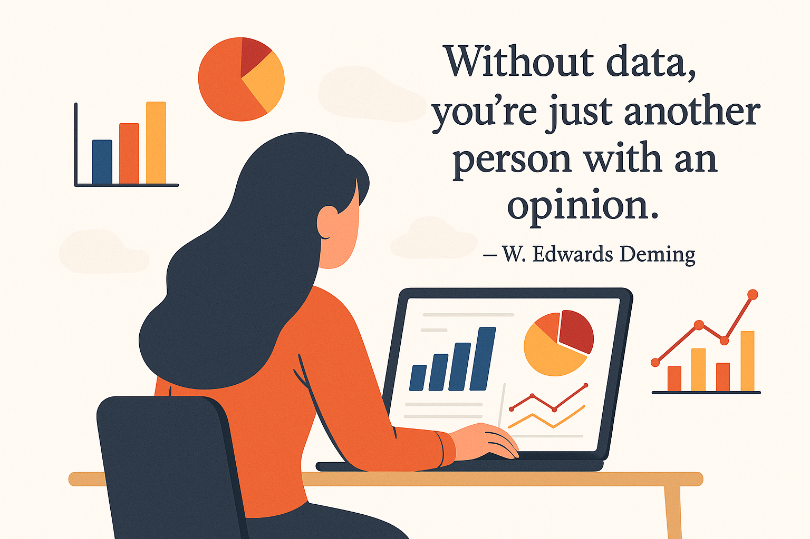

  

## Hi, I'm Shivanjali 👋 | Data Analyst | Operations & CX Analytics

---

### 💡 About Me

- 📊 Data Analyst with 1+ years experience, working at **Maruti Suzuki India Limited** — operations, sales & service analytics
- 🔧 Built 15+ dashboards across Power BI, Tableau, and Excel used by senior leadership for KPI reviews
- 🐍 Python (Pandas, EDA) | SQL (CTEs, Window Functions) | Power BI (DAX, Data Modelling)
- 🏭 Domain expertise in **Operations Analytics, Customer Experience & Service Performance**
- 🌍 Open to **remote and freelance** analyst roles globally
- 🎯 Currently building portfolio projects in Operations & CX Analytics

---

### 🚀 Tech Stack

| Category | Tools |
|----------|-------|
| Languages | Python · SQL · DAX · VBA |
| Visualisation | Power BI · Tableau · Qlik Sense |
| Data Wrangling | Pandas · Power Query · Advanced Excel |
| Databases | MySQL · SQL Server |

---

### 📂 Featured Projects

| Project | Domain | Tools | Key Insight |
|---------|--------|-------|-------------|
| [Manufacturing Performance Dashboard](https://github.com/shivanjali712/Manufacturing-Analysis-Dashboard) | Operations | Power BI · SQL · Excel | Identified bottlenecks that drove 15% reduction in rejections |
| [Crowdfunding Analysis](https://github.com/shivanjali712/Crowdfunding-Project-Analysis) | Business Analytics | SQL · Tableau · Excel | Uncovered success drivers across campaign categories |
| [HR Analytics Dashboard](https://github.com/shivanjali712/HR-Analytics-Dashboard) | Workforce Analytics | Power BI | Tracked attendance, WFH and leave trends for HR decision making |

---

### 📜 Certifications & Achievements

- 🏅 HackerRank SQL — 5 Star Badge
- 📋 Data Analytics Certification — ExcelR
- 🎓 B.E. Computer Engineering — Savitribai Phule Pune University (2025)

---

